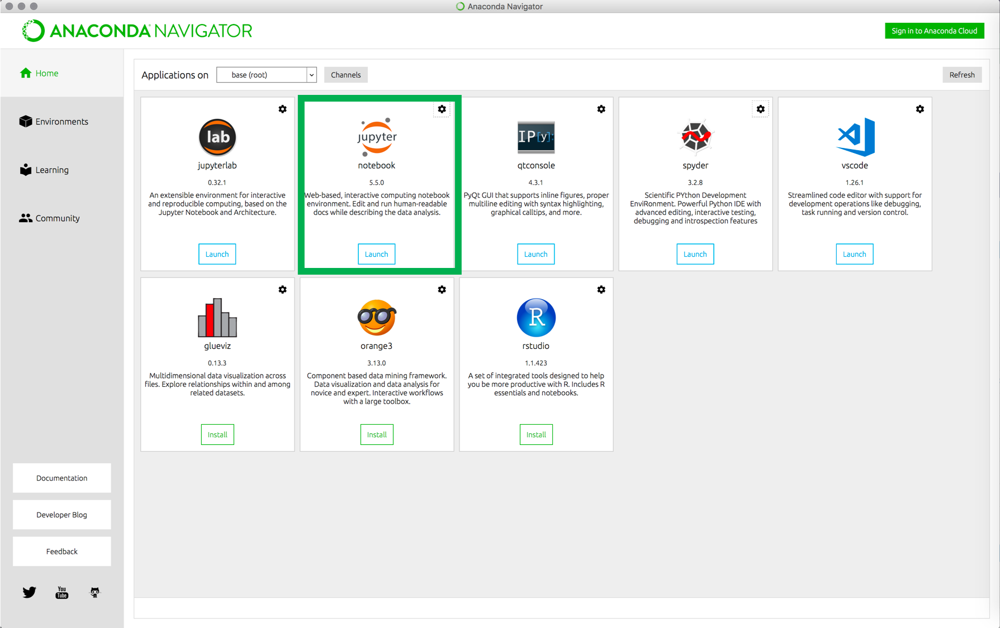

---
output:
  pdf_document: default
  html_document: default
---
# Addiction ShortCourse 2018 - Prerequisites

## Downloading and Installation of Software and Programming enviornments

### R and RStudio
Please ensure you have the latest version of R and RStudio installed on your machine. This is important, as some packages used in the workshop may not install correctly (or at all) if R is not up to date.

Download and install the latest version of R - [download link](http://cran.stat.ucla.edu/)

Download and install RStudio - [download link](https://www.rstudio.com/products/rstudio/download/#download)

### Jupyter Notebook

#### Installing Jupyter using Anaconda
The Jupyter Notebook Developers strongly recommend installing Python and Jupyter using the Anaconda Distribution, which includes Python, the Jupyter Notebook, and other commonly used packages for scientific computing and data science.

Step 1: Download Anaconda. We recommend downloading Anaconda’s latest Python 3 version.

  For macOS - [here](https://www.anaconda.com/download/#macos)
  For Windows - [here](https://www.anaconda.com/download/#windows)

Step 2: Install the version **Python 3.6 version**, following the instructions on the download page.

Step 3: Launch Anaconda-Navigator

Step 4: From the Anaconda-Navigator UI click on the "Launch" button associated with Jupyter Notebooks (highligthed in green)

### Python
The installation of Jupyter Notebook takes care of the installation of Python and therefore we do not need to install Python separately.

