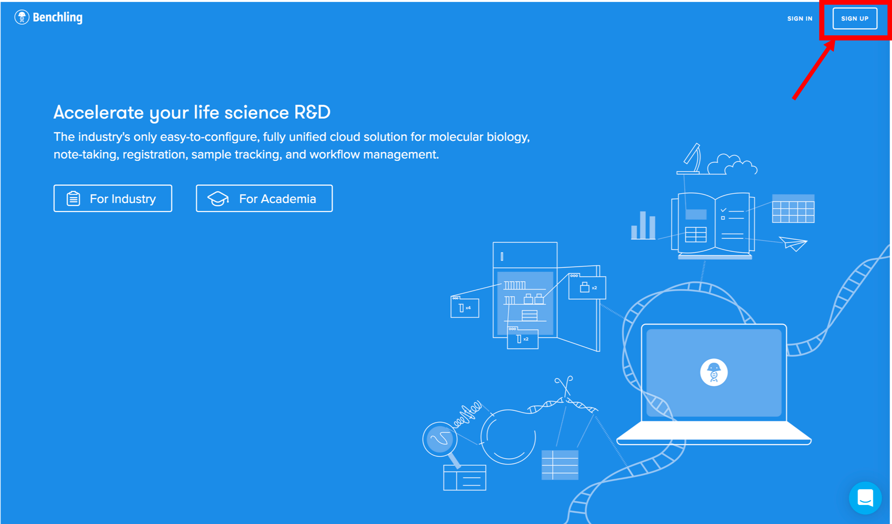

---
output:
  pdf_document: default
  html_document: default
---

# Workshop on Guide Design
The primary objective of this workshop is in understanding the nuances of CRISPR Guide Design and to produce a CRISPR design for point mutation. To do this we will make use of the OPRM1 example from [Kringel et al.](https://www.nature.com/articles/tpj201628); [alternate link](https://www.ncbi.nlm.nih.gov/pmc/articles/PMC5637232/)

# Create a Benchling Account
This workshop uses the tool **Benchling**. Please make sure to create a free account [here](https://benchling.com/signup), prior to the start of this workshop. The signup button is on the top right hand corner of the page.

