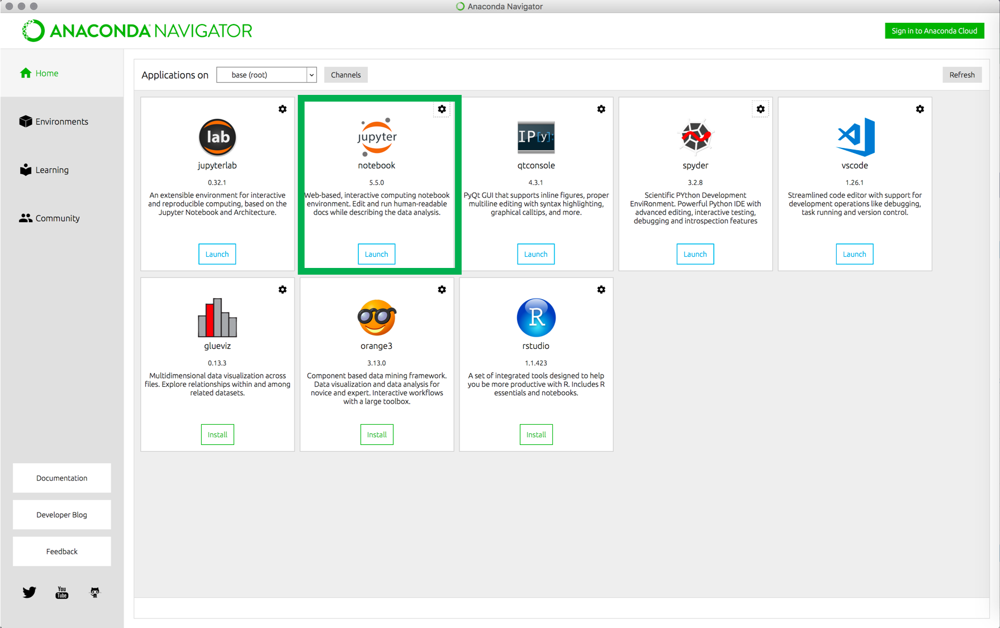

---
output:
  pdf_document: default
  html_document: default
---

Installation of Jupyter Notebooks and Python, which come bundled with Anaconda Navigator are the only prerequisites. If you have already installed these, then please ignore the section below.

### Jupyter Notebook

#### Installing Jupyter using Anaconda
The Jupyter Notebook Developers strongly recommend installing Python and Jupyter using the Anaconda Distribution, which includes Python, the Jupyter Notebook, and other commonly used packages for scientific computing and data science.

Step 1: Download Anaconda. We recommend downloading Anaconda’s latest Python 3 version.

  For macOS - [here](https://www.anaconda.com/download/#macos)
  For Windows - [here](https://www.anaconda.com/download/#windows)

Step 2: Install the version **Python 3.6 version**, following the instructions on the download page.

Step 3: Launch Anaconda-Navigator

Step 4: From the Anaconda-Navigator UI click on the "Launch" button associated with Jupyter Notebooks (highligthed in green)

### Python
The installation of Jupyter Notebook takes care of the installation of Python and therefore we do not need to install Python separately.