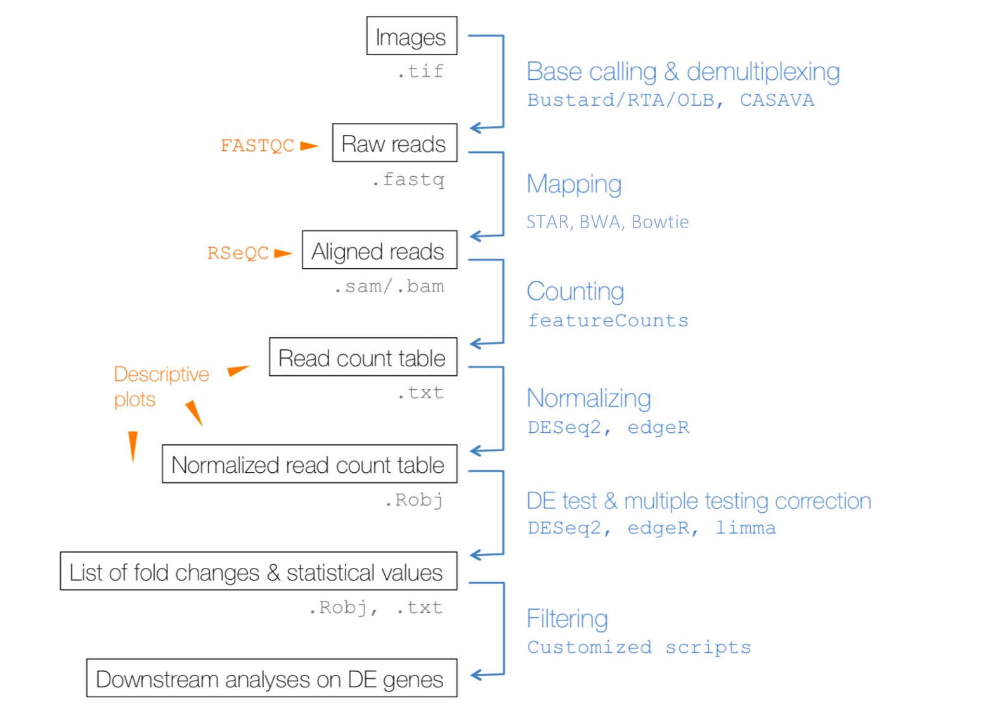
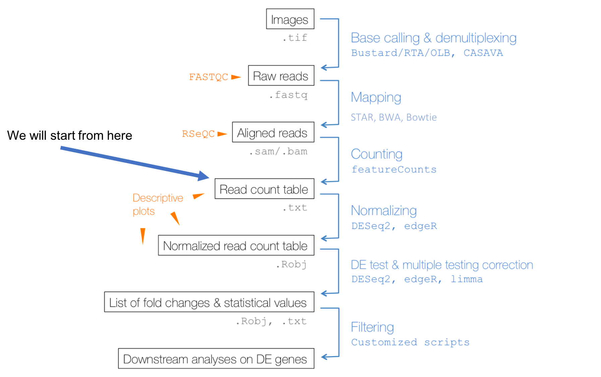
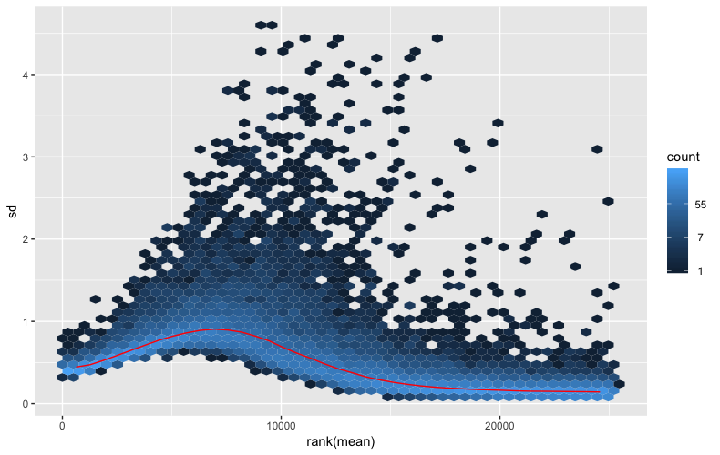
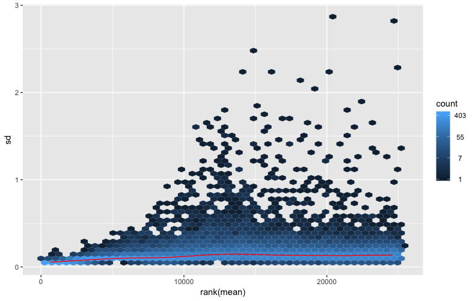

```{r message=FALSE, warning=FALSE}
library(DESeq2)
library(vsn)
library(RColorBrewer)
library(pheatmap)
library(ggplot2)
library(DT)
library(plyr)
library(org.Mm.eg.db)
library(topGO)
source("../code/utils.R")
```

This tutorial will take you through the process of differential gene expression analysis focusing on sex differences across CC/DO founders using Hippocampal gene expression.

The gene expression data comes from hippocampus of CC/DO founder strains. Below is a table of Strain by Sex sample sizes. 

| Strain      | F | M |
|-------------|---|---|
| 129S1/SvImJ | 4 | 4 |
| A/J         | 4 | 4 |
| C57BL/6J    | 4 | 4 |
| CAST/EiJ    | 4 | 4 |
| NOD/ShiLtJ  | 4 | 4 |
| NZO/HlLtJ   | 4 | 4 |
| PWK/PhJ     | 4 | 4 |
| WSB/EiJ     | 4 | 4 |


The experimental design contains enough replicates per strain per sex to allow us to assess Strain x Sex differences in this dataset.

## Installation of required R packages

By now you would have all ready installed the required R packages necessary for the successful completion of this module. If you have **NOT**, please do so now by following the instructions below by pasting them in the R console:

```{r pkgs, eval=FALSE, warning=FALSE, message=FALSE}
source("https://bioconductor.org/biocLite.R")
#libraries for gene expression analysis
biocLite("DESeq2")
biocLite("vsn")

#libraries for table manipulations
install.packages("DT")
install.packages("plyr")

#libraries for visualization
install.packages("ggplot2")
install.packages("pheatmap")
install.packages("RColorBrewer")

#libraries for gene annotation and enrichement analysis
biocLite("org.Mm.eg.db")
biocLite("topGO")

```

## Differential gene expression analysis workflow


You have already been introduced to the various steps in this workflow. For this workshop, we start half way down this workflow, at the step where read in the counts table to assess Strain by Sex differences.




### Read in a counts table and create a DESeq2 object
```{r read_counts_matrix, warning=FALSE, message=FALSE}
countData <- read.table("../data/hp_founder_gex_counts.txt", header = TRUE, check.names = FALSE)
row.names(countData) <- countData$locus
countData <- countData[,-1]
countData <- round(countData)
sampleSheet <- read.table("../data/SampleSheet_Chesler_Founders_Hippocampus_RNASeq.txt", header = TRUE)
strains <- sampleSheet$strain
sex <- sampleSheet$sex

dds <- DESeqDataSetFromMatrix(countData = countData,
                              colData = sampleSheet,
                              design = ~ strain + sex)
```

### Pre-filtering

While it is not necessary to pre-filter low count genes before running the DESeq2 functions, there are two reasons which make pre-filtering useful: by removing rows in which there are very few reads, we reduce the memory size of the dds data object, and we increase the speed of the transformation and testing functions within DESeq2. Here we perform a minimal pre-filtering to keep only rows that have at least 100 reads total. Note that more strict filtering to increase power is automatically applied via independent filtering on the mean of normalized counts within the results function.


```{r pre_filtering}
keep <- rowSums(counts(dds)) >= 100
dds <- dds[keep,]
```

### Data transformations and visualization

**Count data transformations**

In order to test for differential expression, we operate on raw counts and use discrete distributions as described in the previous section on differential expression. However for other downstream analyses – e.g. for visualization or clustering – it might be useful to work with transformed versions of the count data.

#### logarithm 
One of the most commonly used transformations is the logarithm transformation.Since count values for a gene can be zero in some conditions (and non-zero in others), some advocate the use of pseudocounts, i.e. transformations of the form:

y=log~2~(n+n~0~)

where n represents the count values and n0 is a small positive constant.

#### Alternative approches 

[DESeq2](http://bioconductor.org/packages/devel/bioc/vignettes/DESeq2/inst/doc/DESeq2.html) supports two alternate approaches that are better justified and suited for count transformation, in addition to estimating n~0~. These alternatives are:

  1. variance stabilizing transformations (VST) (Tibshirani 1988; Huber et al. 2003; Anders and Huber 2010)
  
  2. regularized logarithm or rlog, which incorporates a prior on the sample differences (Love, Huber, and Anders 2014)

Both transformations produce transformed data on the log2 scale which has been normalized with respect to library size or other normalization factors.

#### Why?
The point of these two transformations, the VST and the rlog, is to remove the dependence of the variance on the mean, particularly the high variance of the logarithm of count data when the mean is low. Both VST and rlog use the experiment-wide trend of variance over mean, in order to transform the data to remove the experiment-wide trend. Note that we do not require or desire that all the genes have exactly the same variance after transformation. Indeed, in a figure below, you will see that after the transformations the genes with the same mean do not have exactly the same standard deviations, but that the experiment-wide trend has flattened. It is those genes with row variance above the trend which will allow us to cluster samples into interesting groups.


```{r ntd_vsd_transform, warning=FALSE, message=FALSE}
ntd <- normTransform(dds)
vsd <- vst(dds, blind=FALSE)
#rld <- rlog(dds, blind=FALSE)
```

### Effects of transformations on the variance - mean-var plots



The code used to create the above plots are provided below, but have not be run.
```{r plot_transform, eval = FALSE, warning=FALSE, message=FALSE} 
#mean-sd plot for logarirthm transform
meanSdPlot(assay(ntd))

#mean-sd plot for VST transform
meanSdPlot(assay(vsd))
```


## Data quality assessment by sample clustering and visualization

### Heatmap of the sample-to-sample distances
```{r s2s_distances, out.height=3200,out.width=1600, warning=FALSE, message=FALSE}
sampleDists <- dist(t(assay(vsd)))

sampleDistMatrix <- as.matrix(sampleDists)
rownames(sampleDistMatrix) <- paste(vsd$strain, vsd$sex, sep="-")
colnames(sampleDistMatrix) <- NULL
colors <- colorRampPalette( rev(brewer.pal(9, "Blues")) )(255)
pheatmap(sampleDistMatrix,
         clustering_distance_rows=sampleDists,
         clustering_distance_cols=sampleDists,
         col=colors)

```

### Principal component plot of the samples
```{r s2s_pca, out.height=800,out.width=800, warning=FALSE, message=FALSE}
pcaData <- plotPCA(vsd, intgroup=c("strain", "sex"), returnData=TRUE)
percentVar <- round(100 * attr(pcaData, "percentVar"))
ggplot(pcaData, aes(PC1, PC2, color=strain, shape=sex)) +
  geom_point(size=3) +
  xlab(paste0("PC1: ",percentVar[1],"% variance")) +
  ylab(paste0("PC2: ",percentVar[2],"% variance")) + 
  coord_fixed()
```


## Multi-factor designs
Experimental deisgns, such as the one we are working with, consisting of more that one factor needs to speficied in the statistical model. But before we get in to that model, let's begin with something simple. Let's us extract all genes with a signigicant strain effect

```{r main_effect_strain, warning=FALSE, message=FALSE}
ddsStrain <- dds
design(ddsStrain) <- formula(~strain)
ddsStrain <- DESeq(ddsStrain, test = "LRT", reduced = ~ 1)
resStrain=results(ddsStrain)
mcols(resStrain, use.names=TRUE)
```

There are **~17000** of genes with a signifcant strain effect. Let's look at the gene with the smallest adjusted p-value.

```{r plot_min_main_strain , warning=FALSE, message=FALSE}
gene="ENSMUSG00000000560"
d <- plotCounts(ddsStrain, gene="ENSMUSG00000000560", intgroup=c("strain"), 
                returnData=TRUE)
d.mean <- aggregate(log(d$count,2), list(d$strain), mean)
colnames(d.mean) <- c("strain","mean_exp")

d.se <- aggregate(log(d$count,2), list(d$strain), sd)
colnames(d.se) <- c("strain","se_exp")
d.se$se_exp <- d.se$se_exp/sqrt(8)

d.grp <- merge.data.frame(d.mean, d.se, by.x="strain", by.y="strain")

ggplot(data=d.grp, aes(x=strain, y=mean_exp, color=strain) ) + 
  ylab("log(exp)") + 
  ggtitle("ENSMUSG00000000560") +
  geom_errorbar(aes(ymin = mean_exp - se_exp, ymax = mean_exp + se_exp), width=0.1) + 
  geom_point()
```


Now, that we have explored and made ourself familiar with the process, let's try and extract all genes with a signifncat strain by sex effect.

```{r strain_by_sex_effect, warning=FALSE, message=FALSE}
ddsMF <- dds
design(ddsMF) <- formula(~ strain + sex + strain:sex)
ddsMF <- DESeq(ddsMF, test = "LRT", reduced = ~ strain + sex)
resMF=results(ddsMF)
```

```{r plot_min_main_strain_by_sex , warning=FALSE, message=FALSE}
gene="ENSMUSG00000031438"
d <- plotCounts(ddsMF, gene="ENSMUSG00000031438", intgroup=c("strain","sex"), 
                returnData=TRUE)

d.mean <- aggregate(log(d$count,2), list(d$strain, d$sex), mean)
colnames(d.mean) <- c("strain","sex","mean_exp")

d.se <- aggregate(log(d$count,2), list(d$strain, d$sex), sd)
colnames(d.se) <- c("strain","sex", "se_exp")
d.se$se_exp <- d.se$se_exp/sqrt(8)

d.grp <- merge(d.mean, d.se, by=c("strain","sex"))

ggplot(d.grp, aes(x=sex, y=mean_exp, color=strain) ) + 
  ylab("log(exp)") +
  ggtitle("ENSMUSG00000031438") + 
  geom_line(aes(group=strain)) +
  geom_errorbar(aes(ymin = mean_exp - se_exp, ymax = mean_exp + se_exp), width=0.1) + 
  geom_point()

```

## Exporting results to CSV files
A comma separated file of the results can be exported using the base R functions write.csv. Here, we will export the results of the differential gene expression analysis wherein we assessed strain by sex difference.

```{r export_to_csv, warning=FALSE, message=FALSE}
resOrdered <- resMF[order(resMF$padj),]
write.csv(as.data.frame(resOrdered), 
          file="../results/DiffExp_Hp_Strain_by_Sex_results.csv")
```

## Gene annotation and gene set enrichment analysis

**Adding gene names to the results**

```{r add_gene_name, warning=FALSE, message=FALSE}
resOrdered$symbol <- convertIDs( row.names(resOrdered), "ENSEMBL", "SYMBOL", org.Mm.eg.db )
resOrdered$entrezid <- convertIDs( row.names(resOrdered), "ENSEMBL", "ENTREZID", org.Mm.eg.db )
resOrdered$chr <- convertIDs( row.names(resOrdered), "ENSEMBL", "CHR", org.Mm.eg.db )
resOrdered$genename <- convertIDs( row.names(resOrdered), "ENSEMBL", "GENENAME", org.Mm.eg.db )

```

**Gene Ontology (GO) enrichment analysis**

Do the genes with a strong up- or down-regulation have something in common? Are certain pathways enriched with genes that are either significantly up- or down- regulated. We can address some of these questions by undertaking a gene erichment analysis.

For a good introduction to GO see [du Plessis et. al. – The what, where, how and why of gene ontology primer for bioinformaticians- Bioinformatics, 2011](https://academic.oup.com/bib/article/12/6/723/221815)

We will perfome the GO enrichment analysis using a method that is well suited for this analyiss - topGO. For more details, please see the following paper - [Alexa et. al. – Improved scoring of functional groups from gene expression data by decorrelating GO graph structure - Bioinformatics, 2006](https://academic.oup.com/bioinformatics/article/22/13/1600/193669)

Since GO has three categories, the code below performs GO enrichment on each of them. The genes being selected for GO are genes that have a significant strain by sex effect with an adjusted p-value < 0.10.

```{r topGO, warning=FALSE, message=FALSE}

sigGenes <- subset(resOrdered, padj < 0.1)
anSig <- data.frame(ENSEMBL=row.names(sigGenes), SYMBOL=sigGenes$symbol, GENENAME=sigGenes$genename)
  

onts = c( "MF", "BP", "CC" )
geneIDs = row.names(resOrdered)
inUniverse = geneIDs %in% geneIDs
inSelection =  geneIDs %in% anSig$ENSEMBL 
alg <- factor( as.integer( inSelection[inUniverse] ) )
names(alg) <- geneIDs[inUniverse]

tab = as.list(onts)
names(tab) = onts
for(i in 1:3) {
  
  ## prepare data
  tgd <- new( "topGOdata", ontology=onts[i], allGenes = alg, nodeSize=5,
              annot=annFUN.org, mapping="org.Mm.eg.db", ID = "ensembl" )
  
  ## run tests
  resultTopGO.elim <- runTest(tgd, algorithm = "elim", statistic = "Fisher" )
  resultTopGO.classic <- runTest(tgd, algorithm = "classic", statistic = "Fisher" )
  
  ## look at results
  tab[[i]] <- GenTable( tgd, Fisher.elim = resultTopGO.elim, 
                        Fisher.classic = resultTopGO.classic,
                        orderBy = "Fisher.classic" , topNodes = 200)
  
  tab[[i]]$Ont <- rep(onts[i], dim(tab[[i]])[1])
}

topGOResults <- rbind.fill(tab)
write.csv(topGOResults, file = "../results/DiffExp_Hp_Strain_by_Sex_topGOResults.csv")
```

Below is a searchable table of the enrichment results.

```{r topGO_table, warning=FALSE, message=FALSE, eval=FALSE}
datatable(topGOResults)
```

