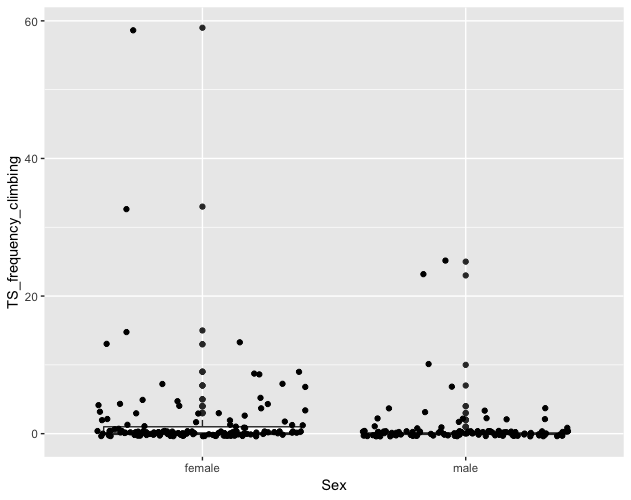
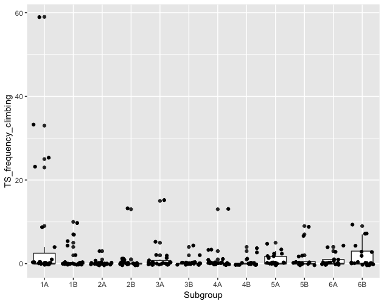
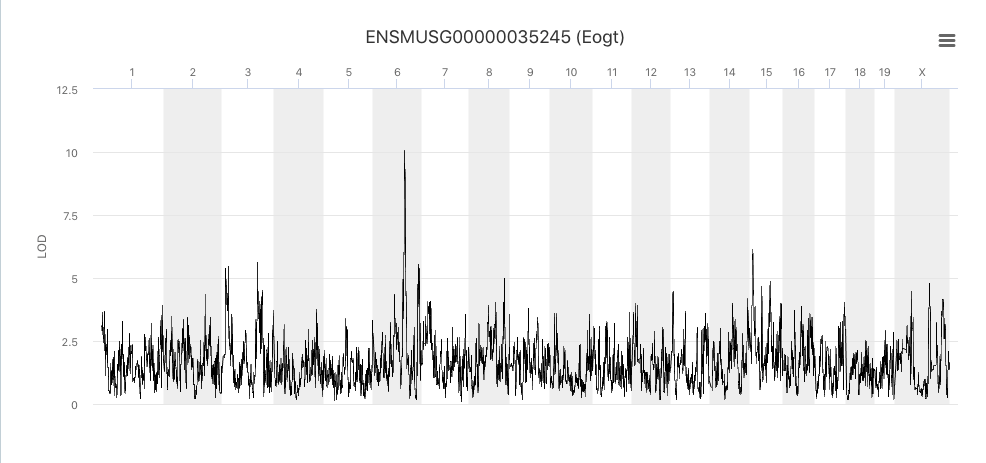

```{r message=FALSE, echo=FALSE, warning=FALSE}
library(qtl2)
library(ggplot2)
library(GGally)
library(reshape)
#library(qtl2plot)
```

This tutorial will take you through the process of mapping a QTL and prioritizing candidate genes.

The data comes from a behavioral study in which Diversity Outbred (DO) mice were we characterized *283* male and female DO mice using open-field, light–dark box, tail-suspension and visual-cliff avoidance tests to generate 38 behavioral measures. We identified several quantitative trait loci (QTL) for these traits with support intervals ranging from 1 to 3 Mb in size. These intervals contain relatively few genes (ranging from 5 to 96). For a majority of QTL, using the founder allelic effects together with whole genome sequence data, we could further narrow the positional candidates. Several QTL replicate previously published loci. Novel loci were also identified for anxiety- and activity-related traits. Half of the QTLs are associated with wild-derived alleles, confirming the value to behavioral genetics of added genetic diversity in the DO. In the presence of wild-alleles we sometimes observe behaviors that are qualitatively different from the expected response. Our results demonstrate that high-precision mapping of behavioral traits can be achieved with moderate numbers of DO animals, representing a significant advance in our ability to leverage the mouse as a tool for behavioral genetics


There are two publications associated with these data. These are [Recla JM, et al. (2014) (<i>Mamm Genome</i> 25:211-222)](https://www.ncbi.nlm.nih.gov/pubmed/24700285) and 
[Logan RW, et al. (2014) (<i>Genes Brain Behav</i> 12:424-437)](https://www.ncbi.nlm.nih.gov/pubmed/23433259)


## Installation of required R packages

By now you would have all ready installed the required R packages necessary for the successful completion of this module. If you have **NOT**, please do so now by following the instructions below by pasting them in the R console:

1. [qtl2](https://kbroman.org/qtl2/) - install.packages("qtl2", repos="http://rqtl.org/qtl2cran")

2. [ggplot2](https://ggplot2.tidyverse.org/) - install.packages("ggplot2")

3. [GGally](https://github.com/ggobi/ggally) - install.packages("GGally")


## QTL mapping workflow


### Trait heritability
Heritability estimates for the 38 behavioral measurements were calculated from the progenitor strain data using variance components from a mixed model with strain as a random effect. 

Heritabilities can also be computed on measurements collected using the DO by leveraging the information containted in the kinship matrix.


### Load and explore the data

```{r load_data, warning=FALSE}
do.cross <- read_cross2("../data/DO_2014/DO2014.json")
summary(do.cross)
```


#### The Marker Map  
The markers are from a genotyping array called the Mouse Universal Genotyping Array (MUGA) and contains 7,856 SNP markers. Marker locations for the MUGA and other mouse arrays are available from [The Jackson Laboratory's FTP site](ftp://ftp.jax.org/MUGA).

#### Phenotype distributions

**Open field (OF)**

```{r plot_phenotypes_OF, warning=FALSE, message=FALSE, fig.height=8, fig.width=8, echo=FALSE}
pheno <- as.data.frame(do.cross$pheno)
OF <- grep(colnames(pheno), pattern = "^OF")
ggpairs(pheno[,OF])
```


**Light Dark (LD)**

```{r plot_phenotypes_LD, warning=FALSE, message=FALSE, fig.height=8, fig.width=8, echo=FALSE}
pheno <- as.data.frame(do.cross$pheno)
LD <- grep(colnames(pheno), pattern = "^LD")
ggpairs(pheno[,LD])
```


**Tail Suspension Test (TST)**

```{r plot_phenotypes_TST, warning=FALSE, message=FALSE, fig.height=8, fig.width=8, echo=FALSE}
pheno <- as.data.frame(do.cross$pheno)
TS <- grep(colnames(pheno), pattern = "^TS")
ggpairs(pheno[,TS])
```


## QTL mapping of climbing frequency in the tail suspension test


#### **Genotype (allele) probabilities**
```{r calc_genoprob}
n_cores <- 1
probs <- calc_genoprob(do.cross, error_prob=0.002, map_function="c-f", cores=n_cores)
```

We now convert the genotype probabilities to haplotype dosages.

```{r genoprob_to_alleleprob}
aprobs <- genoprob_to_alleleprob(probs, cores=n_cores)
```

A closer look at the **eight** haplotypes for just the Chr 1 markers and couple of the DO mice.
#### Sample 1  - Chr 1
```{r sample1, echo=FALSE}
plot_genoprob(aprobs, map=do.cross$gmap, chr=1, ind = 10)

```


#### Sample 10  - Chr 1
```{r sample10, echo=FALSE}
plot_genoprob(aprobs, map=do.cross$gmap, chr=1, ind = 10)
```


#### **Calculate a kinship matrix**
```{r calc_kinship}
kinship <- calc_kinship(aprobs, "loco", cores=n_cores)

image(1:nrow(kinship[[1]]), 1:ncol(kinship[[1]]), kinship[[1]][,ncol(kinship[[1]]):1], xlab = "Samples", 
      ylab = "Samples", yaxt = "n", main = "Kinship between samples", 
      breaks = 0:100/100, col = heat.colors(length(0:100) - 1))

```


The figure above shows kinship between all pairs of samples. White ( = 1) indicates no kinship and red ( = 0) indicates full kinship. Orange values indicate varying levels of kinship between 0 and 1. The white diagonal of the matrix indicates that each sample is identical to itself. The lighter yellow blocks off of the diagonal may indicate siblings or cousins.

#### **Covariates**
```{r explore_covar, echo=FALSE, warning=FALSE, message=FALSE}
pheno <- as.data.frame(do.cross$pheno)
covar <- as.data.frame(do.cross$covar)

TS <- grep(colnames(pheno), pattern = "^TS")
TS.pheno <- cbind.data.frame(pheno[,TS], covar)
TS.pheno$ngen <- paste("G0", TS.pheno$ngen, sep="")
TS.pheno$ngen <- as.factor(TS.pheno$ngen)

ggplot(TS.pheno, aes(Sex,TS_frequency_climbing)) + geom_boxplot() + geom_jitter()
ggplot(TS.pheno, aes(ngen,TS_frequency_climbing)) + geom_boxplot() + geom_jitter()
ggplot(TS.pheno, aes(Cohort,TS_frequency_climbing)) + geom_boxplot() + geom_jitter()
ggplot(TS.pheno, aes(Group,TS_frequency_climbing)) + geom_boxplot() + geom_jitter()
ggplot(TS.pheno, aes(Subgroup,TS_frequency_climbing)) + geom_boxplot() + geom_jitter()
ggplot(TS.pheno, aes(coat_color,TS_frequency_climbing)) + geom_boxplot() + geom_jitter()


```






#### **Including covariates in the mapping model**
```{r addcovar}
addcovar = model.matrix(~ngen+Group, data = TS.pheno)[,-1]
```


#### **Running a genomescan**

Before we run the mapping function, let's look at the mapping model. At each marker on the genotyping array, we will fit a model that regresses the phenotype *LD_light_pct* on covariates and the founder allele probabilities.


  where:  
  
<ul>
<li><i>y<sub>i</sub></i> is the phenotype for mouse <i>i</i>,</li>
  <li><i>&beta;<sub>s</sub></i> is the effect of study cohort,</li>
  <li><i>s<sub>i</sub></i> is the study cohort for mouse <i>i</i>,</li>
  <li><i>&beta;<sub>j</sub></i> is the effect of founder allele <i>j</i>,</li>
  <li><i>g<sub>ij</sub></i> is the probability that mouse <i>i</i> carries an allele from founder <i>j</i>,</li>
  <li><i>&lambda;<sub>i</sub></i> is an adjustment for kinship-induced correlated errors for mouse <i>i</i>,</li>
  <li><i>&epsilon;<sub>i</sub></i> is the residual error for mouse <i>i</i>.</li>
  </ul>  

Note that this model will give us an estimate of the effect of each founder allele at each marker. There are eight founder strains that contributed to the DO, so we will get eight founder allele effects.


In order to map LD_light_pct, you will use the [scan1](https://github.com/rqtl/qtl2/blob/master/R/plot_scan1.R) function. To see the arguments for [scan1](https://github.com/rqtl/qtl2/blob/master/R/plot_scan1.R), you can type `help(scan1)`. First, let's map the *untransformed* phenotype.

```{r QTL, warning=FALSE, error=FALSE}
index = which(colnames(pheno) == "TS_frequency_climbing")
qtl.climb = scan1(genoprobs = aprobs, pheno = pheno[,index, drop = FALSE], kinship = kinship, addcovar = addcovar)
```

Plot of the results, all in gray except for the trait with the largest
LOD score, in blue.

```{r plot_scan1_TS_frequency_climbing}
plot_scan1(x = qtl.climb, map = do.cross$pmap, main = "Climbing frequency")
```


#### Performing a permutation test

There is resonably  large peak on Chr 6, with two additional peaks on Chr 14 and chr 16. Next, we must assess its statistical significance. This is most commonly done via [permutation](http://www.genetics.org/content/178/1/609.long). We advise running at least 1,000 permutations to obtain significance thresholds. In the interest of time, we perform 100 permutations here.

```{r perms, message=FALSE, results='hide', warning=FALSE}
perms = scan1perm(genoprobs = aprobs, pheno = pheno[,index, drop = FALSE], addcovar = addcovar, n_perm = 100)
```

The `perms` object contains the maximum LOD score from each genome scan of permuted data.

We can now add thresholds to the previous QTL plot. We use a significance threshold of p < 0.05. To do this, we select the 95th percentile of the permutation LOD distribution.
           
```{r qtl_plot_thr, fig.width=8, fig.height=6, warning=FALSE}
plot(x = qtl.climb, map = do.cross$pmap,  main = "Climbing frequency")
thr95 = summary(perms, alpha = 0.05)
thr90 = summary(perms, alpha = 0.10)
thr63 = summary(perms, alpha = 0.63)
abline(h = c(thr95), col = "red", lwd = 3)
abline(h = c(thr90), col = "green", lwd = 2)
abline(h = c(thr63), col = "blue", lwd = 1)
```


The peak on Chr 6 is above the green (p<0.10) significance line.
#### Finding LOD peaks
We can then plot the QTL scan. Note that you must provide the marker map, which we loaded earlier in the MUGA SNP data.

We can find all of the peaks above the significance threshold using the [find_peaks](https://github.com/rqtl/qtl2/blob/master/R/find_peaks.R) function.

```{r find_peaks}
find_peaks(scan1_output = qtl.climb, map = do.cross$pmap, threshold = thr63)
```


The support interval is determined using the [Bayesian Credible Interval](http://www.ncbi.nlm.nih.gov/pubmed/11560912) and represents the region most likely to contain the causative polymorphism(s). We can obtain this interval by adding a `prob` argument to [find_peaks](https://github.com/rqtl/qtl2/blob/master/R/find_peaks.R). We pass in a value of `0.95` to request a support interval that contains the causal SNP 95% of the time.

```{r interval}
find_peaks(scan1_output = qtl.climb, map = do.cross$pmap, threshold = thr90, prob = 0.95)
```

From the output above, you can see that the support interval is 2.48 Mb wide (95.67 to 98.15 Mb). The location of the maximum LOD score is at 97.82 Mb.

#### Estimated QTL effects

We will now zoom in on Chr 6 and look at the contribution of each of the eight founder alleles to the proportion of bone marrow reticulocytes that were micro-nucleated. Remember, the mapping model above estimates the effect of each of the eight DO founders. We can plot these effects (also called 'coefficients') across Chr 6 using [scan1coef](https://github.com/rqtl/qtl2/blob/master/R/scan1coef.R).

```{r coef}
chr = 6
coef06 = scan1blup(genoprobs = aprobs[,chr], pheno = pheno[,index, drop = FALSE], kinship = kinship[[chr]], addcovar = addcovar)
```

This produces an object containing estimates of each of the eight DO founder allele effect. These are the <i>&beta;<sub>j</sub></i> values in the mapping equation above.

```{r coef_plot, fig.width=8, fig.height=6, warning=FALSE, error=FALSE}
plot_coefCC(x = coef06, map = do.cross$pmap, scan1_output = qtl.climb, main = "Climbing frequency")
```


The top panel shows the eight founder allele effects (or model coefficients) along Chr 6. The founder allele effects are centerd at zero and the units are the same as the phenotype. You can see that DO mice containing the PWK/PhJ allele (red) have higher climbing frequencies relative to the other seven founders. Additional DO mice with C57BL/6J (grey) and PWK/PhJ (green) alleles have lower climbing frequncies. This means that the  PWK/PhJ allele is associated with increased climbing and is potentially indicative of lower anxeity and higher exploration. The bottom panel shows the LOD score, with the support interval for the peak shaded blue. 


#### SNP Association Mapping

At this point, we have a 2.50 Mb wide support interval that contains a polymorphism(s) that influences climbing behavior. Next, we will impute the DO founder sequences onto the DO genomes. The [Sanger Mouse Genomes Project](http://www.sanger.ac.uk/resources/mouse/genomes/) has sequenced the eight DO founders and provides SNP, insertion-deletion (indel), and structural variant files for the strains (see [Baud et.al., Nat. Gen., 2013](http://www.nature.com/ng/journal/v45/n7/full/ng.2644.html)). We can impute these SNPs onto the DO genomes and then perform association mapping. 

## This section requires the following files:
- cc_variants.sqlite [Download here](https://doi.org/10.6084/m9.figshare.5280229.v2) : These are the variants in the Collaborative Cross founders (3 GB)
- mouse_genes.sqlite [Download here](https://doi.org/10.6084/m9.figshare.5280238.v4) : full set of mouse gene annotations (677 MB)

Please download them and place them under the data directory


{height=120%, width=120%}

Association mapping involves imputing the founder SNPs onto each DO genome and fitting the mapping model at each SNP. At each marker, we fit the following model:  


where:

<ul>
<li><i>y<sub>i</sub></i> is the phenotype for mouse <i>i</i>,</li>
  <li><i>&beta;<sub>s</sub></i> is the effect of study cohort,</li>
  <li><i>s<sub>i</sub></i> is the study cohort for mouse <i>i</i>,</li>
  <li><i>&beta;<sub>m</sub></i> is the effect of adding one allele at marker <i>m</i>,</li>
  <li><i>g<sub>im</sub></i> is the allele call for mouse <i>i</i> at marker <i>m</i>,</li>
  <li><i>&lambda;<sub>i</sub></i> is an adjustment for kinship-induced correlated errors for mouse </i>i</i>,</li>
  <li><i>&epsilon;<sub>i</sub></i> is the residual error for mouse <i>i</i>.</li>
  </ul>  

We can call [scan1snps](https://github.com/rqtl/qtl2/blob/master/R/scan1snps.R) to perform association mapping in the QTL interval on Chr 6. We first create variables for the chromosome and support interval where we are mapping. We then create a function to get the SNPs from the founder SNP database The path to the SNP database (`snpdb_file` argument) points to the data directory on your computer. Note that it is important to use the `keep_all_snps = TRUE` in order to return all SNPs.

```{r assoc_map}
chr = 6
start = 95
end = 99
query_func = create_variant_query_func("../data/cc_variants.sqlite")
assoc = scan1snps(genoprobs = aprobs[,chr], map = do.cross$pmap, pheno = pheno[,index,drop = FALSE], kinship = kinship, addcovar = addcovar, query_func = query_func, chr = chr, start = start, end = end, keep_all_snps = TRUE)
```

The `assoc` object is a list containing two objects: the LOD scores for each unique SNP and a `snpinfo` object that maps the LOD scores to each SNP. To plot the association mapping, we need to provide both objects to the [plot_snpasso](https://github.com/rqtl/qtl2/blob/master/R/plot_snpasso.R) function.

```{r assoc_fig, fig.width=9, fig.height=6, warning=FALSE, error=FALSE}
plot_snpasso(scan1output = assoc$lod, snpinfo = assoc$snpinfo, main = "Climbing frequency")
```


This plot shows the LOD score for each SNP in the QTL interval. The SNPs occur in "shelves" because all of the SNPs in a haplotype block have the same founder strain pattern. The SNPs with the highest LOD scores are the ones for which CAST/EiJ contributes the alternate allele.

We can add a plot containing the genes in the QTL interval using the `plot_genes` function. We get the genes from another SQLlite database created by [Karl Broman](https://github.com/kbroman) called `mouse_genes.sqlite`. You should have downloaded this from the [JAX FTP Site](ftp://ftp.jax.org/dgatti/CC_SNP_DB/mouse_genes.sqlite) during [Setup](../setup.md).

First, we must query the database for the genes in the interval. The path of the first argument points to the data directory on your computer.

```{r get_genes}
query_genes = create_gene_query_func(dbfile = "../data/mouse_genes.sqlite", filter = "source='MGI'")
genes = query_genes(chr, start, end)
head(genes)
```

The `genes` object contains annotation information for each gene in the interval.

Next, we will create a plot with two panels: one containing the association mapping LOD scores and one containing the genes in the QTL interval. We do this by passing in the `genes` argument to [plot_snpasso](https://github.com/rqtl/qtl2/blob/master/R/plot_snpasso.R).

```{r plot_assoc2, warning=FALSE,fig.width=12,fig.height=12, error=FALSE, echo=FALSE}
plot_snpasso(assoc$lod, assoc$snpinfo, main = "Climbing frequency", genes=genes)
```


#### Identification of Candidate Genes

One strategy for finding genes related to a phenotype is to search for genes with expression QTL (eQTL) in the same location. We just happen to have gene expression from the **striatum** and **hippocampus**, with the hippocampal gene expression generated from these exact same mice. We searched for genes in the QTL interval that had an eQTL in the same location. Then, we looked at the pattern of founder effects to see if PWK/PhJ stood out in addition to C57BL/6J and CAST/EiJ showing the same pattern. We found one gene that met these criteria. Below is an cis-eQTL from the DO Straitum for the gene *Eogt*, with founder strain effects in the same direction as that of the behavioral QTL.




#### Other resources for prioritizing candidate gene

**GeneWeaver** - Since we learnt about GeneWeaver a few days ago, let us submit our list of candidate genes to GeneWeaver. In doing so, we will be able to find out more about the genes within our list by studying them futher.

**Mouse Genome Informatics (MGI)** - MGI will allow us to serach for mutations and alleles that affect additional or similar phenotypes for our list of candidates genes. Furthermore, we can identify aviable gene knock-outs to further validate these candidate genes.

Before we use these resources, let us first save our list of candidate genes to a file for use later.

```{r write_candidate_genes}
write.csv(file="../results/Chr6_candidate_genes_climbing_frequency_DO.csv", genes, row.names = FALSE, quote = FALSE)

```

