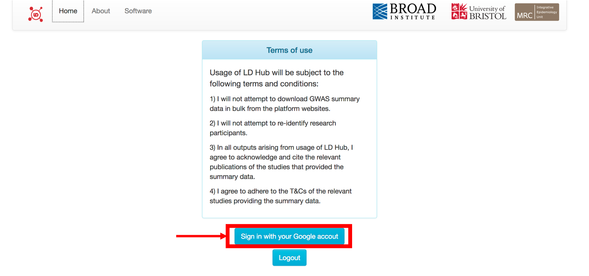
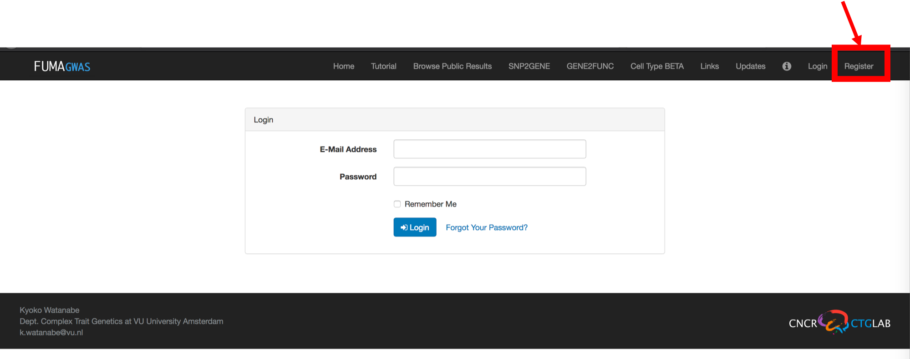

---
output:
  html_document: default
  pdf_document: default
---

# Recent methods for polygenic analysis of genome-wide data

## Primary objective
The primary objective of this module is to:
- Estimate SNP-heritability
- Calculate genetic correlations
- Perform functional mapping and annotation of genetic associations

## Dataset and tools
The datasets and tools that will be used in the workshop will leverage publicly avialable resources

- Summary statistics (PGC, GWAS catalog):
  - https://www.med.unc.edu/pgc/results-and-downloads
  - https://www.ebi.ac.uk/gwas/downloads/summary-statistics

- SNP-heritability and genetic correlations (LDHub):
  - http://ldsc.broadinstitute.org/ldhub/

**You will need to login in to LDHub using your gmail account**

- Functional annotation (FUMA):
  - http://fuma.ctglab.nl/login

**You will need to create an user account to use FUMA**

However, if for some reason there are difficulties in doing so we have created the following account:

- account: jaxpolygenicity@gmail.com; password: jaxpolygenicity2018

