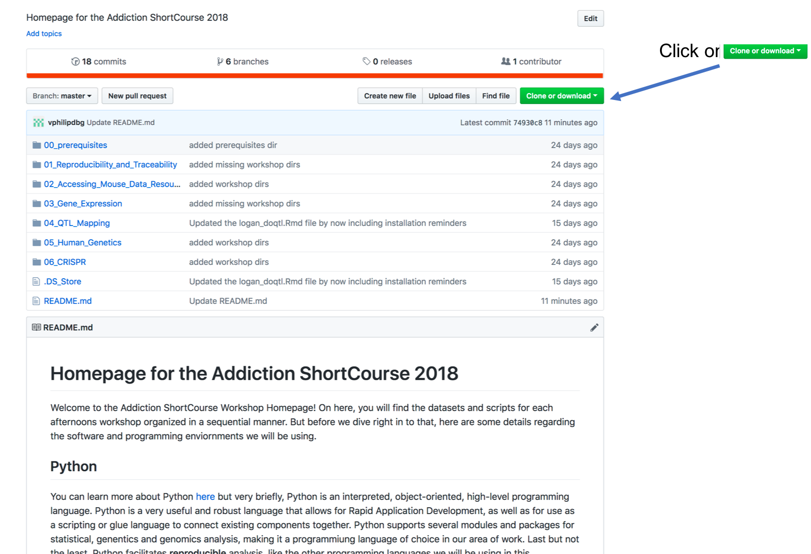
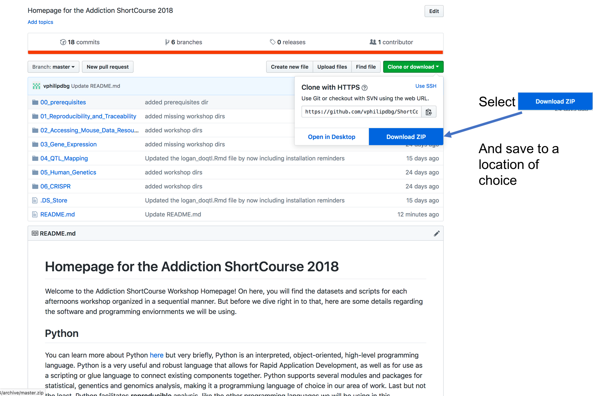

# Homepage for the Addiction ShortCourse 2019

Welcome to the Addiction ShortCourse Workshop Homepage! On here, you will find the datasets and scripts for each afternoons workshop organized in a sequential manner. But before we dive right in to that, here are some details regarding the contents you will find here along with software and programming enviornments we will be using. 

## Organization of Course Content
The course content has been organing into folders reflecting each of the six hands-on workshops. These folders have been arranged in a sequential manner, reflecting the flow of the course. The instructions for the installation of software and associated materials (R packages, Python libraries) are contained in the folder **00_prerequisites**.

## Software and Programming enviornments
These softwares and programming enviornments work on both Macs and PCs.

## ***Please note that you will most likely need administrative privileges to install the software***

### Python
You can learn more about Python [here](https://www.python.org/about/) but very briefly, Python is an interpreted, object-oriented, high-level programming language. Python is a very useful and robust language that allows for Rapid Application Development, as well as for use as a scripting or glue language to connect existing components together. Python supports several modules and packages for statistical, genentics and genomics analysis, making it a programmiung language of choice in our area of work. Last but not the least, Python facilitates **reproducible** analysis, like the other programming languages we will be using in this ShortCourse.

### Jupyter Notebook
The [Jupyter Notebook](http://jupyter.org/) is an open-source web application platform that allows users to create and share code, narrative text and visualizations. It is commonly used in conjuction with Python for purposes such as data cleaning and transformation, statistical modeling and data visualization in addition to much more. Jupyter Notebooks are a great way of enabling and excuting repdroducible research.

### R
[R](https://www.r-project.org/about.html) is an Open Source language and environment for statistical computing and graphics. It is similar to the S language and environment which was developed at Bell Laboratories (formerly AT&T, now Lucent Technologies) by John Chambers and colleagues. R can be considered as a different implementation of S. Like Python, R provides a wide variety of statistical and graphical techniques, and more importantly allows one to perform reproducible analysis.

### RStudio
[RStudio](https://www.rstudio.com/) is a set of integrated tools designed to help you be more productive with R. It includes a console, syntax-highlighting editor that supports direct code execution, and a variety of robust tools for plotting, viewing history, debugging and managing your workspace. 

## Downloading all the material at once
We suggest downloading all the contents at once to a location of your choosing on your laptop.

### Step 1

### Step 2

### Step 3
Unzip the zipped file to now have all the contents needed for this workshop on your local system.

### Step 4
Please begin by going to the **00_prerequisites** folder before doing anything else. This folder contains installation instructions for softwares and libraries that are required for the successful completion of the workshop modules. 

